# SlimApp

A minimalist platform-agnostic app layer for desktop apps written in plain C. 
A bare-bone application executable on Windows measures at around 13 KB(!) 
Can be complied in either C or C++ (only uses the subset of C that C++ also supports). 
Available as either a single header file, or a directory of headers (a "unity build" setup).

Architecture:  
-
The platform layer only uses operating-system header(s). 
The appication layer has no dependencies - not even on the platform layer or any standard library. 
It is just a library that the platform layer uses (has no knowledge of the platform). 

More details on this architecture [here](https://youtu.be/Ev_TeQmus68).

Features:
-
Well documented example applications cover the features: 

* Bare-bone application (one-liner): Well-behaved window (can be resized minimized/maximized and closed) 
  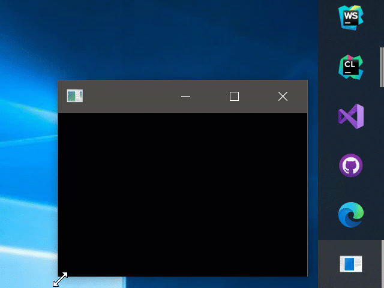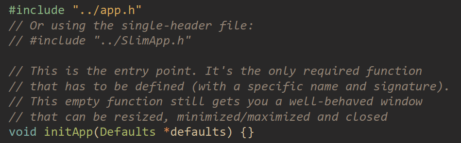
* Overridable window defaults: Initial dimensions and title. 
  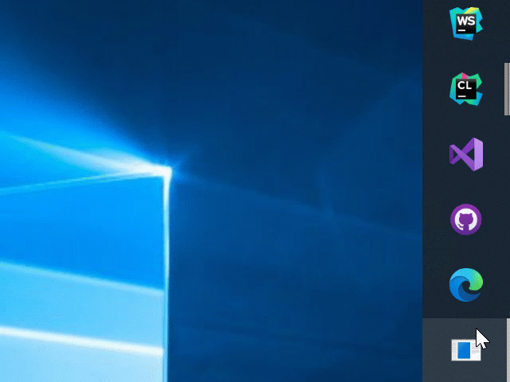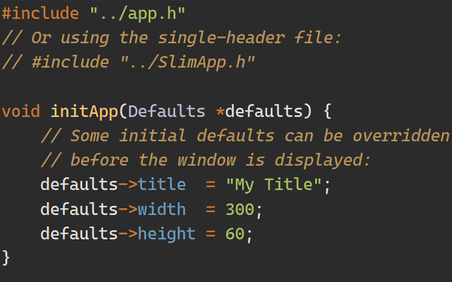
* Timers and window-title control: 
  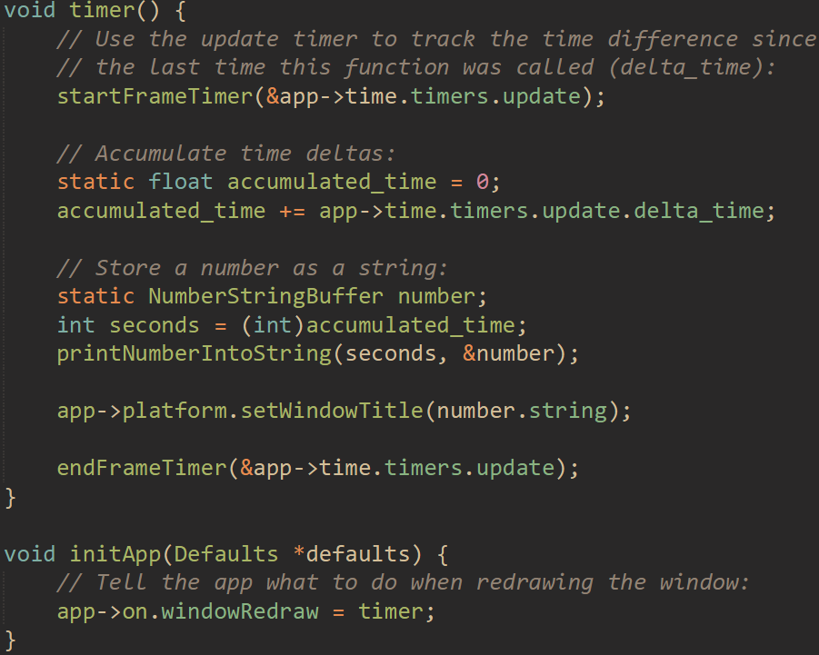
* Drawable window content: Basic shape drawing (Lines, rectangles, triangles and circles) 
  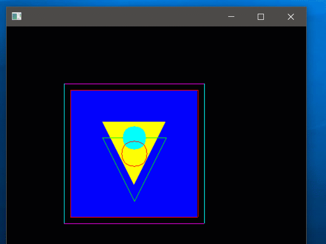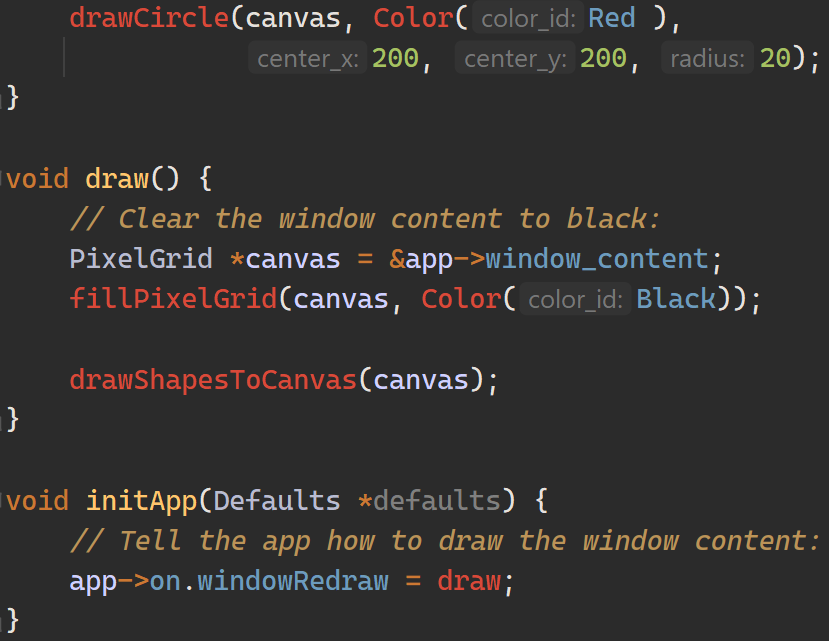
* Text: String and number drawing: 
  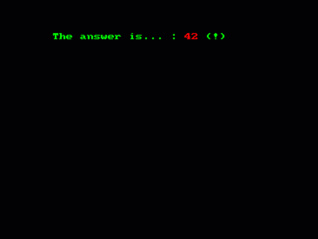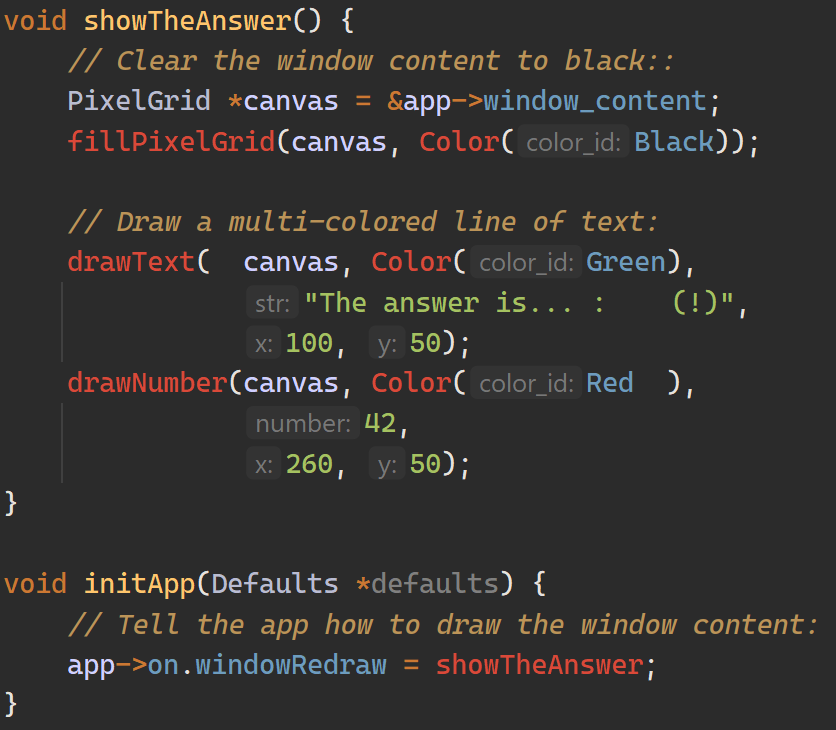
* Mouse: Buttons (+wheel), cursor position/movement and 'raw' mouse input (captured outside the window). 
  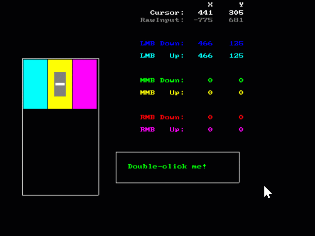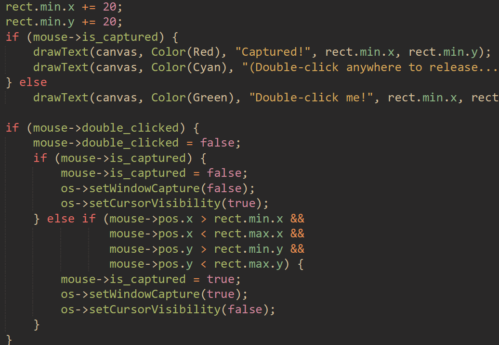
* Keyboard: General key tracking + built-in tracking of control keys status (Ctrl, Alt, Shift, Space) 
  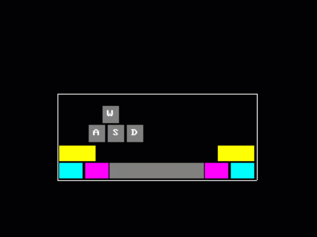
* Game: Built-in linear memory allocator (a.k.a: Arena) can be used for heap memory, and stored on the App. 
  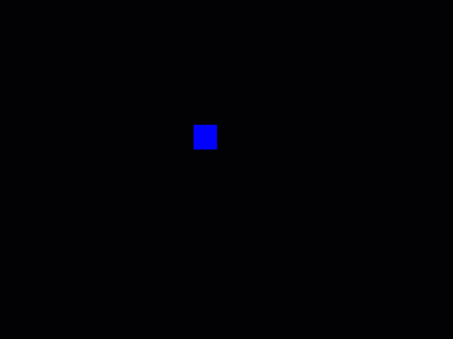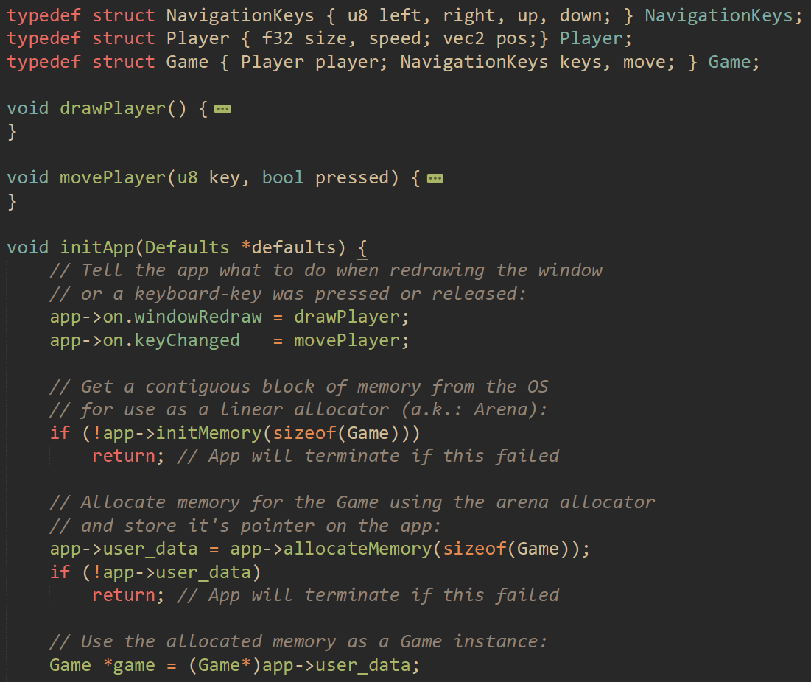

<i>*All input capturing for mouse and keyboard is overridable via callbacks (settable function pointers)</i> 